# DotnetTaskApi - Task Management System

A comprehensive .NET 9 Web API project for managing user tasks with advanced filtering capabilities. This RESTful API provides full CRUD operations along with specialized search and filtering endpoints for efficient task organization and tracking.

## 🚀 Features

- **Complete CRUD Operations**: Create, Read, Update, and Delete tasks
- **Advanced Filtering**: Search tasks by title, description, date, and status
- **Database Integration**: MySQL database with Entity Framework Core migrations
- **API Documentation**: Interactive Swagger UI for endpoint testing
- **Status Management**: Enum-based task status system (Running, Completed, Pending, OnHold)
- **Validation**: Built-in request validation and error handling
- **Development Ready**: Configured for local development with comprehensive logging

## Configure Swagger

- Add package
```shell
    dotnet add package Swashbuckle.AspNetCore
    dotnet restore
```

- Remove AddOpenApi() and MapOpenApi() and add UseSwagger() and UseSwaggerUI()
```csharp
if (app.Environment.IsDevelopment())
{
    app.UseSwagger();
    app.UseSwaggerUI();
}
```

- Swagger as default page
```csharp
    app.MapGet("/", () => Results.Redirect("/swagger")); 
```

## Configure DBContext

- Install Microsoft.EntityFrameworkCore package
```shell
dotnet add package Microsoft.EntityFrameworkCore
dotnet add package Pomelo.EntityFrameworkCore.MySql
dotnet add package Microsoft.EntityFrameworkCore.Design
dotnet restore
```

- Create DbContext file (`Context/OrganizerContext.cs`)
```csharp
public class OrganizerContext : DbContext
{
    public OrganizerContext(DbContextOptions<OrganizerContext> options) : base(options) { }
    
    public DbSet<UserTask> UserTasks { get; set; } = default!;
}
```

- Add connection string in `appsettings.Development.json`
```json
{
  "ConnectionStrings": {
    "MySqlConnection": "server=localhost;port=3306;database=organizerdb;user=root;password="
  }
}
```

- Configure DbContext in `Program.cs`
```csharp
builder.Services.AddDbContext<OrganizerContext>(options =>
    options.UseMySql(builder.Configuration.GetConnectionString("MySqlConnection"),
    new MySqlServerVersion(new Version(8, 0, 26)))
);
```

## 📁 Project Structure

```mermaid
graph TD
    A[DotnetTaskApi] --> B[Controllers/]
    A --> C[Models/]
    A --> D[Context/]
    A --> E[Migrations/]
    A --> F[DTOs/]
    A --> G[Repositories/]
    A --> H[Services/]
    A --> I[Properties/]
    A --> J[Configuration Files]
    
    B --> B1[TaskController.cs<br/>📡 REST API endpoints]
    
    C --> C1[UserTask.cs<br/>📋 Main entity model]
    C --> C2[UserTaskStatus.cs<br/>🔄 Status enumeration]
    
    D --> D1[OrganizerContext.cs<br/>🗃️ EF DbContext]
    
    E --> E1[CreateTaskTable.cs<br/>📊 Migration files]
    E --> E2[Designer & Snapshot<br/>🔧 EF metadata]
    
    F --> F1[Ready for expansion<br/>📦 DTOs]
    G --> G1[Ready for implementation<br/>🏪 Repository pattern]
    H --> H1[Ready for implementation<br/>⚙️ Business logic]
    
    I --> I1[launchSettings.json<br/>🚀 Launch config]
    
    J --> J1[Program.cs<br/>⚡ Entry point]
    J --> J2[appsettings.json<br/>⚙️ App settings]
    J --> J3[DotnetTaskApi.http<br/>🧪 API testing]

    style A fill:#e1f5fe
    style B1 fill:#f3e5f5
    style C1 fill:#e8f5e8
    style C2 fill:#e8f5e8
    style D1 fill:#fff3e0
```



## Getting Started

### Prerequisites
- .NET 9 SDK
- MySQL Server (version 8.0+)
- IDE (Visual Studio, VS Code, or JetBrains Rider)

### Installation

1. Clone the repository
2. Navigate to the project directory
3. Restore NuGet packages:
   ```shell
   dotnet restore
   ```
4. Update the MySQL connection string in `appsettings.Development.json`
5. Run the application:
   ```shell
   dotnet run
   ```
6. Navigate to `https://localhost:7xxx` (port will be displayed in terminal) to access Swagger UI

### Database Setup

1. Ensure MySQL server is running
2. Create the database:
   ```sql
   CREATE DATABASE organizerdb;
   ```
3. Create Entity Framework migration:
   ```shell
   dotnet ef migrations add CreateTaskTable
   ```
4. Run Entity Framework migrations:
   ```shell
   dotnet ef database update
   ```

## 🏗️ System Architecture

```mermaid
graph TB
    Client[👤 Client Applications<br/>Browser, Postman, etc.] --> Swagger[📖 Swagger UI<br/>Interactive Documentation]
    Client --> API[🌐 ASP.NET Core Web API<br/>Task Management Endpoints]
    
    API --> Controller[🎮 TaskController<br/>REST API Endpoints]
    Controller --> Context[🗃️ OrganizerContext<br/>Entity Framework DbContext]
    Context --> Database[(🗄️ MySQL Database<br/>organizerdb)]
    
    Controller --> Models[📊 Models]
    Models --> UserTask[📋 UserTask Entity]
    Models --> Status[🔄 UserTaskStatus Enum]
    
    API --> Middleware[⚙️ Middleware Pipeline]
    Middleware --> CORS[🌐 CORS Policy]
    Middleware --> Auth[🔐 Authentication<br/>Ready for implementation]
    Middleware --> Logging[📝 Logging & Monitoring]
    
    Database --> Migrations[📈 EF Migrations<br/>Schema Version Control]

    style Client fill:#e3f2fd
    style API fill:#f3e5f5
    style Database fill:#e8f5e8
    style Controller fill:#fff3e0
    style Models fill:#fce4ec
```



## 📋 API Endpoints

### Task Management Endpoints

| Method | Endpoint | Description |
|--------|----------|-------------|
| `GET` | `/Task` | Retrieve all tasks |
| `GET` | `/Task/{id}` | Retrieve a specific task by ID |
| `POST` | `/Task` | Create a new task |
| `PUT` | `/Task/{id}` | Update an existing task |
| `DELETE` | `/Task/{id}` | Delete a task |

### Advanced Filtering Endpoints

| Method | Endpoint | Description |
|--------|----------|-------------|
| `GET` | `/Task/bytitle/{title}` | Search tasks by title (partial match) |
| `GET` | `/Task/bydescription/{description}` | Search tasks by description (partial match) |
| `GET` | `/Task/bydate/{date}` | Get tasks by specific date |
| `GET` | `/Task/bystatus/{status}` | Filter tasks by status |

### Task Status Values
- `Running` (0) - Task is currently in progress
- `Completed` (1) - Task has been finished
- `Pending` (2) - Task is waiting to be started
- `OnHold` (3) - Task is temporarily paused

## 🔄 API Operation Flow


## 📊 Data Models


**UserTaskStatus Enum Values:**
- `Running` (0) - Task is currently in progress
- `Completed` (1) - Task has been finished
- `Pending` (2) - Task is waiting to be started  
- `OnHold` (3) - Task is temporarily paused

### UserTask Model

```csharp
public class UserTask
{
    public int Id { get; set; }
    public string? Title { get; set; }
    public string? Description { get; set; }
    public DateTime Date { get; set; }
    public UserTaskStatus Status { get; set; }
}
```

### UserTaskStatus Enum

```csharp
public enum UserTaskStatus
{
    Running,
    Completed,
    Pending,
    OnHold
}
```

## 🛠️ Technologies & Dependencies

| Technology | Version | Purpose |
|------------|---------|---------|
| **.NET** | 9.0 | Latest .NET framework with enhanced performance |
| **ASP.NET Core Web API** | 9.0 | RESTful API development framework |
| **Entity Framework Core** | 9.0.10 | Object-Relational Mapping (ORM) |
| **MySQL** | 8.0+ | Relational database management system |
| **Pomelo.EntityFrameworkCore.MySql** | 9.0.0 | MySQL provider for Entity Framework Core |
| **Swashbuckle.AspNetCore** | 9.0.6 | Swagger/OpenAPI documentation and testing UI |
| **Microsoft.AspNetCore.OpenApi** | 9.0.9 | OpenAPI specification support |

### Key Features
- **Nullable Reference Types**: Enhanced null safety with C# nullable annotations
- **Implicit Usings**: Cleaner code with automatic using statements
- **Entity Framework Migrations**: Database schema version control
- **Swagger Integration**: Interactive API documentation and testing interface

## 🧪 Testing the API

### Using Swagger UI
1. Run the application: `dotnet run`
2. Navigate to `https://localhost:7xxx/swagger` (port will be shown in terminal)
3. Use the interactive interface to test all endpoints

### Using HTTP File
The project includes `DotnetTaskApi.http` file with pre-configured requests for VS Code REST Client extension.

### Sample API Calls

**Create a new task:**
```json
POST /Task
Content-Type: application/json

{
  "title": "Complete project documentation",
  "description": "Update README and add API examples",
  "date": "2024-10-21T10:00:00",
  "status": 2
}
```

**Search tasks by title:**
```
GET /Task/bytitle/project
```

**Filter by status:**
```
GET /Task/bystatus/1
```

## 🚀 Development Workflow

### Building the Project
```bash
# Restore dependencies
dotnet restore

# Build the project
dotnet build

# Run the application
dotnet run

# Watch for changes (hot reload)
dotnet watch run
```

### Database Operations
```bash
# Add a new migration
dotnet ef migrations add MigrationName

# Update database with latest migrations
dotnet ef database update

# Remove last migration (if not applied to database)
dotnet ef migrations remove
```

## 🚀 Development & Deployment Workflow

```mermaid
flowchart TD
    Start([🚀 Start Development]) --> Clone[📥 Clone Repository]
    Clone --> Restore[📦 dotnet restore]
    Restore --> DB{🗄️ Database Setup}
    
    DB -->|New Setup| CreateDB[🏗️ Create MySQL Database]
    DB -->|Existing| Migration[🔄 Run Migrations]
    CreateDB --> Migration
    
    Migration --> MigCmd[💻 dotnet ef database update]
    MigCmd --> Build[🔨 dotnet build]
    Build --> Test{🧪 Tests Pass?}
    
    Test -->|❌ Failed| Fix[🔧 Fix Issues]
    Fix --> Build
    Test -->|✅ Passed| Run[▶️ dotnet run]
    
    Run --> Swagger[📖 Open Swagger UI]
    Swagger --> DevTest[🧪 Test Endpoints]
    DevTest --> Code[💻 Code Changes]
    
    Code --> HotReload{🔥 Hot Reload?}
    HotReload -->|Yes| Watch[👀 dotnet watch run]
    HotReload -->|No| Build
    
    Watch --> DevTest
    Code --> Commit[📝 Git Commit]
    Commit --> Deploy{🚀 Deploy?}
    
    Deploy -->|Production| ProdBuild[🏗️ Production Build]
    Deploy -->|Development| DevTest
    
    ProdBuild --> ProdDB[🗄️ Production Database]
    ProdDB --> Release[🎉 Release]

    style Start fill:#e8f5e8
    style Release fill:#e8f5e8
    style Test fill:#fff3e0
    style Deploy fill:#f3e5f5
```



## 🤝 Contributing

1. Fork the repository
2. Create a feature branch (`git checkout -b feature/amazing-feature`)
3. Commit your changes (`git commit -m 'Add some amazing feature'`)
4. Push to the branch (`git push origin feature/amazing-feature`)
5. Open a Pull Request

## 📝 License

This project is part of the Avanade Bootcamp training program.

---
*Built with ❤️ using .NET 9 and Entity Framework Core*
